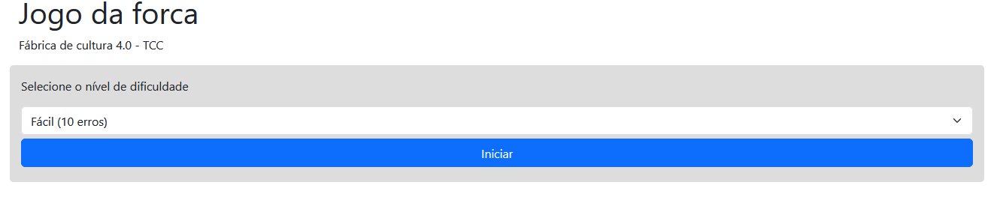

# 🎮 Jogo da Forca — Fábrica de Cultura 4.0

> Jogo da forca interativo desenvolvido como Trabalho de Conclusão de Curso (TCC) do programa **Fábrica de Cultura 4.0**, iniciativa da Prefeitura de São Paulo.

[](https://fabrica-de-cultura-4-0-tcc-71fa46.gitlab.io/)
[](https://developer.mozilla.org/pt-BR/docs/Web/HTML)
[](https://developer.mozilla.org/pt-BR/docs/Web/CSS)
[](https://developer.mozilla.org/pt-BR/docs/Web/JavaScript)
[](https://getbootstrap.com/)

---

## 🌐 Demo ao Vivo

**▶️ [Jogar agora](https://fabrica-de-cultura-4-0-tcc-71fa46.gitlab.io/)**

---

## 📸 Screenshot



---

## 🎯 Sobre o Projeto

Este projeto foi desenvolvido individualmente como **Trabalho de Conclusão de Curso (TCC)** do programa **Fábrica de Cultura 4.0**, iniciativa da **Prefeitura de São Paulo** voltada à inclusão digital e capacitação tecnológica de jovens e adultos.

O objetivo foi aplicar na prática os conhecimentos adquiridos durante o programa, desenvolvendo uma aplicação web funcional e interativa do zero — sem frameworks JavaScript, utilizando apenas HTML5, CSS3, Bootstrap e JavaScript puro.

---

## 🕹️ Como Jogar

1. Acesse a [aplicação](https://fabrica-de-cultura-4-0-tcc-71fa46.gitlab.io/)
2. **Selecione o nível de dificuldade** antes de iniciar
3. **Digite letras** para tentar descobrir a palavra oculta
4. Acompanhe seus **acertos, erros e letras usadas** no painel de informações
5. Para encerrar a partida a qualquer momento, **digite `!`**
6. Tente acertar a palavra antes de atingir o limite de erros!

---

## ⚙️ Níveis de Dificuldade

O jogo oferece três níveis, cada um reduzindo o número máximo de erros permitidos:

| Nível | Erros Permitidos | Descrição |
|-------|-----------------|-----------|
| 😊 **Fácil** | 10 erros | Ideal para iniciantes |
| 😐 **Médio** | 6 erros | Equilíbrio entre desafio e diversão |
| 😰 **Difícil** | 4 erros | Para os mais corajosos! |

---

## 📊 Painel de Informações

Durante o jogo, o painel exibe em tempo real:

- 🔤 **Letras** — total de letras na palavra
- ✅ **Acertos** — letras corretas descobertas
- ❌ **Erros** — tentativas incorretas realizadas

---

## 🛠️ Tecnologias Utilizadas

| Tecnologia | Uso no Projeto |
|------------|---------------|
| **HTML5** | Estrutura semântica da aplicação |
| **CSS3** | Estilização customizada |
| **Bootstrap** | Layout responsivo e componentes visuais |
| **JavaScript** | Lógica do jogo, manipulação do DOM e interatividade |

> Desenvolvido com **JavaScript puro** (Vanilla JS), sem frameworks como React, Vue ou Angular — demonstrando domínio dos fundamentos da linguagem.

---

## 📁 Estrutura do Projeto

```
Fabrica-de-Cultura-4.0_TCC/
├── index.html        # Estrutura principal da aplicação
├── css/
│   └── style.css     # Estilos customizados
├── js/
│   └── app.js        # Lógica do jogo
└── README.md
```

---

## 🚀 Como Executar Localmente

Não requer instalação ou dependências — basta abrir no navegador!

```bash
# Clone o repositório
git clone https://github.com/rapassos/Fabrica-de-Cultura-4.0_TCC.git

# Entre na pasta
cd Fabrica-de-Cultura-4.0_TCC

# Abra o arquivo principal no navegador
# Linux/Mac:
open index.html

# Ou simplesmente arraste o index.html para o navegador
```

---

## 🔮 Implementações Futuras

Funcionalidades planejadas para versões futuras:

- [ ] **API de palavras aleatórias** — Integração com dicionário online gratuito para geração dinâmica de palavras, substituindo o set fixo atual
- [ ] **Sistema de login e perfil** — Autenticação de usuários para armazenamento de placar pessoal e histórico de partidas
- [ ] **Categorias de palavras** — Seleção por temas (tecnologia, esportes, cultura, etc.)
- [ ] **Placar global** — Ranking entre jogadores
- [ ] **Representação visual da forca** — Desenho progressivo conforme os erros aumentam

---

## 📚 Contexto de Aprendizado

### O que este projeto demonstra

- ✅ **Manipulação do DOM** com JavaScript puro
- ✅ **Lógica de programação** aplicada (controle de estado, validações, condicionais)
- ✅ **Layout responsivo** com Bootstrap
- ✅ **Interatividade** via eventos de teclado
- ✅ **Organização de código** sem dependência de frameworks
- ✅ **Deploy** de aplicação estática com GitLab Pages

### Sobre o Programa Fábrica de Cultura 4.0

O **Fábrica de Cultura 4.0** é um programa da **Prefeitura de São Paulo** que oferece cursos de tecnologia e programação para a comunidade, com foco em inclusão digital. Este TCC representa a conclusão da formação em desenvolvimento web.

---

## 🌐 Deploy

Hospedado gratuitamente via **GitLab Pages** com deploy automático a cada commit na branch principal.

**URL:** https://fabrica-de-cultura-4-0-tcc-71fa46.gitlab.io/

---

## 👤 Autor

**Rafael Passos Guimarães**

Analista de Infraestrutura | 15+ anos em TI | Transição para Cloud & DevOps

- 💼 LinkedIn: [@rapassos](https://linkedin.com/in/rapassos)
- 🐙 GitHub: [@rapassos](https://github.com/rapassos)
- 🦊 GitLab: [@rapassos](https://gitlab.com/rapassos)
- 📧 Email: rapassos@gmail.com

---

## 📄 Licença

Este projeto está sob a licença MIT — veja o arquivo [LICENSE](LICENSE) para detalhes.

---

> 💡 **Nota:** Este projeto marca mais um passo da minha jornada em desenvolvimento web, desenvolvido em 2020 como TCC de um programa de inclusão digital. Representa a aplicação prática de fundamentos que continuam sendo a base para projetos mais complexos com frameworks modernos e cloud computing.
